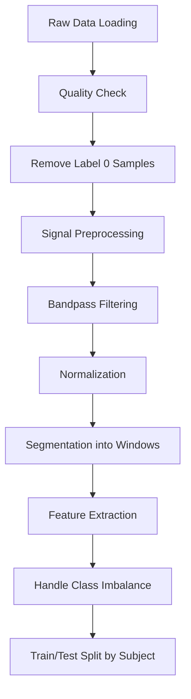

# WESAD Dataset: A Practical Learning Guide for AI Students

> **A hands-on guide to understanding, analyzing, and preprocessing multimodal physiological data for stress and affect detection**

---

## Table of Contents
1. [Introduction](#introduction)
2. [Understanding the Dataset](#understanding-the-dataset)
3. [Step-by-Step Data Exploration Process](#step-by-step-data-exploration-process)
4. [Data Structure Deep Dive](#data-structure-deep-dive)
5. [Key Challenges & Industry Insights](#key-challenges--industry-insights)
6. [Preprocessing Pipeline](#preprocessing-pipeline)
7. [Assumptions & Critical Thinking Points](#assumptions--critical-thinking-points)
8. [Real-World Implementation Tips](#real-world-implementation-tips)
9. [Common Mistakes to Avoid](#common-mistakes-to-avoid)
10. [Next Steps for Your Project](#next-steps-for-your-project)

---

## Introduction

### What is WESAD?

**WESAD (Wearable Stress and Affect Detection)** is a publicly available multimodal dataset designed for research in stress and affect recognition. It was collected by researchers at TU Darmstadt and contains physiological and motion data from 15 subjects wearing two devices:

- **RespiBAN Professional** (chest-worn): High-frequency medical-grade sensor
- **Empatica E4** (wrist-worn): Consumer-grade wearable device

### Why This Guide Matters

> [!IMPORTANT]
> This guide teaches you **what textbooks don't** — the practical challenges, messy realities, and industry approaches to handling real-world physiological data.

When you work with WESAD (or similar datasets), you'll encounter:
- Multi-modal data at different sampling rates
- Significant class imbalance
- Missing labels and noise
- Sensor-specific artifacts
- Subject variability

This guide documents the exact process used to understand this dataset and provides actionable insights for your own projects.

---

## Understanding the Dataset

### Dataset Overview

| Aspect | Details |
|--------|---------|
| **Subjects** | 15 participants (S2, S3, S4, S5, S6, S7, S8, S9, S10, S11, S13, S14, S15, S16, S17) |
| **Duration** | ~2 hours per subject |
| **Modalities** | Chest (6 signals) + Wrist (4 signals) |
| **Labels** | 8 affective states (0-7) |
| **File Format** | Python pickle (`.pkl`), CSV, TXT, ZIP |
| **Total Size** | ~15 GB (approx. 1 GB per subject) |

### The Protocol (What Subjects Did)

Subjects went through a structured protocol including:

| Phase | Code | Description |
|-------|------|-------------|
| Not defined | 0 | Transient/unlabeled periods |
| Baseline | 1 | Neutral reading task |
| Stress | 2 | TSST (Trier Social Stress Test) |
| Amusement | 3 | Watching funny video clips |
| Meditation | 4 | Guided meditation |
| Additional states | 5, 6, 7 | Study-specific reading, fun activities |

---

## Step-by-Step Data Exploration Process

> [!TIP]
> This is the exact methodology used to understand this dataset. Follow these steps with ANY new dataset.

### Step 1: Understand the File Structure

**What we did:**
```
d:\WESAD\WESAD\
├── S2/
│   ├── S2.pkl           (975 MB - main data file)
│   ├── S2_E4_Data.zip   (1.8 MB - raw Empatica data)
│   ├── S2_quest.csv     (1 KB - questionnaire responses)
│   ├── S2_readme.txt    (481 bytes - subject metadata)
│   └── S2_respiban.txt  (261 MB - raw RespiBAN data)
├── S3/
│   └── ... (same structure)
└── wesad_readme.pdf     (official documentation)
```

**Key Insight:** The `.pkl` file contains preprocessed, synchronized data. The raw files (`_respiban.txt`, `_E4_Data.zip`) are useful if you need to reprocess from scratch.

### Step 2: Load and Inspect the Main Data File

```python
import pickle

# Always use encoding='latin1' for this dataset
with open('WESAD/S2/S2.pkl', 'rb') as f:
    data = pickle.load(f, encoding='latin1')

# First question: What are the top-level keys?
print(data.keys())  # ['signal', 'label', 'subject']
```

**Industry Practice:** Always start by understanding the schema before diving into specifics.

### Step 3: Map the Data Hierarchy

```python
# Go deeper - what signals are available?
print(data['signal'].keys())  # ['chest', 'wrist']

# Chest signals
print(data['signal']['chest'].keys())
# ['ACC', 'ECG', 'EMG', 'EDA', 'Temp', 'Resp']

# Wrist signals
print(data['signal']['wrist'].keys())
# ['ACC', 'BVP', 'EDA', 'TEMP']
```

### Step 4: Examine Signal Shapes and Sampling Rates

```python
import numpy as np

# Chest signals analysis
chest = data['signal']['chest']
for key, val in chest.items():
    print(f'{key}: shape={val.shape}')

# Output:
# ACC:  shape=(4255300, 3)  → 3-axis accelerometer
# ECG:  shape=(4255300, 1)  → Electrocardiogram  
# EMG:  shape=(4255300, 1)  → Electromyography
# EDA:  shape=(4255300, 1)  → Electrodermal Activity
# Temp: shape=(4255300, 1)  → Body Temperature
# Resp: shape=(4255300, 1)  → Respiration
```

**Critical Calculation:** Estimate sampling rate
```python
# Duration ≈ 2 hours = 7200 seconds
# Chest samples = 4,255,300
# Sampling rate ≈ 4,255,300 / 7200 ≈ 700 Hz

# Wrist signals have different rates:
# ACC:  194,528 samples → ~27-32 Hz
# BVP:  389,056 samples → ~54-64 Hz  
# EDA:  24,316 samples  → ~3-4 Hz
# TEMP: 24,316 samples  → ~3-4 Hz
```

### Step 5: Analyze Label Distribution

```python
labels = data['label']
unique, counts = np.unique(labels, return_counts=True)

# Result:
# Label 0: 2,142,701 samples (50.35%) - UNLABELED
# Label 1: 800,800 samples (18.82%)   - Baseline
# Label 2: 430,500 samples (10.12%)   - Stress
# Label 3: 253,400 samples (5.95%)    - Amusement
# Label 4: 537,599 samples (12.63%)   - Meditation
# Label 6: 45,500 samples (1.07%)     - Other
# Label 7: 44,800 samples (1.05%)     - Other
```

> [!CAUTION]
> **50% of data is Label 0** (unlabeled/transient periods). You MUST handle this in preprocessing!

---

## Data Structure Deep Dive

### Signal Details

#### Chest Signals (RespiBAN @ 700 Hz)

| Signal | Description | Shape | Use Case |
|--------|-------------|-------|----------|
| **ACC** | 3-axis accelerometer | (N, 3) | Motion artifacts, activity detection |
| **ECG** | Electrocardiogram | (N, 1) | Heart rate, HRV extraction |
| **EMG** | Electromyography | (N, 1) | Muscle tension |
| **EDA** | Electrodermal Activity | (N, 1) | Skin conductance (stress marker) |
| **Temp** | Body Temperature | (N, 1) | Thermoregulation |
| **Resp** | Respiration | (N, 1) | Breathing rate, patterns |

#### Wrist Signals (Empatica E4)

| Signal | Description | Shape | Sampling Rate |
|--------|-------------|-------|---------------|
| **ACC** | 3-axis accelerometer | (N, 3) | 32 Hz |
| **BVP** | Blood Volume Pulse | (N, 1) | 64 Hz |
| **EDA** | Electrodermal Activity | (N, 1) | 4 Hz |
| **TEMP** | Skin Temperature | (N, 1) | 4 Hz |

### Subject Metadata (from `_readme.txt`)

```
Age: 27
Height (cm): 175
Weight (kg): 80
Gender: male
Dominant hand: right

Study pre-requisites:
- Coffee consumption: NO
- Sports today: NO
- Smoker: NO
- Feeling ill: NO

Additional notes:
The RespiBAN temperature sensor was not fully attached...
```

**Key Insight:** Always read per-subject readme files! They contain important notes about data quality issues.

### Questionnaire Data (from `_quest.csv`)

Contains self-reported affect measures:
- **PANAS**: Positive and Negative Affect Schedule
- **STAI**: State-Trait Anxiety Inventory
- **DIM**: Dimensional affect ratings
- **SSSQ**: Short Stress State Questionnaire

---

## Key Challenges & Industry Insights

### Challenge 1: Multi-Rate Data Synchronization

**The Problem:** Chest signals are at 700 Hz, but wrist EDA is at 4 Hz. How do you combine them?

**Industry Solutions:**

```python
# Option A: Downsample high-frequency to low-frequency
from scipy.signal import resample

# Downsample chest EDA (700 Hz) to match wrist EDA (4 Hz)
chest_eda = data['signal']['chest']['EDA']
target_length = data['signal']['wrist']['EDA'].shape[0]
chest_eda_downsampled = resample(chest_eda, target_length, axis=0)

# Option B: Upsample low-frequency (less recommended)
# Can introduce artifacts

# Option C: Work in windows (RECOMMENDED)
# Compute features over fixed-time windows (e.g., 60 seconds)
window_size_sec = 60
chest_window = 700 * window_size_sec  # 42,000 samples
wrist_window = 4 * window_size_sec    # 240 samples
```

> [!TIP]
> **Industry Standard:** Use fixed-time windows (30-60 seconds) and compute statistical features within each window. This naturally handles different sampling rates.

### Challenge 2: Massive Class Imbalance

**The Numbers:**
- Label 0 (unlabeled): 50.35%
- Useful labels (1-7): 49.65%
- Stress (2): Only 10%

**Industry Solutions:**

```python
# Step 1: Remove label 0 (transient periods)
mask = labels != 0
valid_labels = labels[mask]
valid_signals = {k: v[mask] for k, v in chest.items()}

# Step 2: Further balance using techniques:
# - Oversampling (SMOTE for time-series)
# - Undersampling majority class
# - Weighted loss functions
# - Stratified sampling for train/test split
```

### Challenge 3: Subject Variability (The Hidden Problem)

> [!WARNING]
> Physiological signals vary SIGNIFICANTLY between individuals. A model trained on pooled data may learn subject-specific patterns, not generalizable stress patterns.

**Industry Solutions:**

```python
# Subject-independent validation (Leave-One-Subject-Out)
from sklearn.model_selection import LeaveOneGroupOut

subjects = ['S2', 'S3', 'S4', ...]  # 15 subjects
logo = LeaveOneGroupOut()

for train_idx, test_idx in logo.split(X, y, groups=subject_ids):
    # Train on 14 subjects, test on 1
    # This simulates real-world deployment
    pass
```

### Challenge 4: Label Alignment with Different Sampling Rates

**The Problem:** Labels are at 700 Hz (aligned with chest). How do you get labels for wrist signals at 4 Hz?

```python
# Labels match chest sampling rate (700 Hz)
# For wrist EDA (4 Hz), you need to downsample labels

import numpy as np

# Every 175 chest samples = 1 wrist EDA sample (700/4 = 175)
wrist_labels = labels[::175]  # Simple approach

# Better: Use mode within each window
window = 175
wrist_labels = []
for i in range(0, len(labels), window):
    chunk = labels[i:i+window]
    wrist_labels.append(np.bincount(chunk.astype(int)).argmax())
```

---

## Preprocessing Pipeline

### Recommended Pipeline



### Step 1: Quality Check

```python
def quality_check(data, subject_id):
    """Check for common data issues"""
    
    # Check for NaN values
    for sensor, signals in data['signal'].items():
        for sig_name, sig_data in signals.items():
            nan_count = np.isnan(sig_data).sum()
            if nan_count > 0:
                print(f"WARNING: {subject_id} {sensor}/{sig_name} has {nan_count} NaN values")
    
    # Check label distribution
    labels = data['label']
    unique, counts = np.unique(labels, return_counts=True)
    print(f"{subject_id} label distribution: {dict(zip(unique, counts))}")
    
    # Check signal ranges
    for sensor, signals in data['signal'].items():
        for sig_name, sig_data in signals.items():
            if np.any(np.isinf(sig_data)):
                print(f"WARNING: {subject_id} {sensor}/{sig_name} has infinite values")
```

### Step 2: Signal Preprocessing

```python
from scipy.signal import butter, filtfilt

def butter_bandpass(lowcut, highcut, fs, order=4):
    nyq = 0.5 * fs
    low = lowcut / nyq
    high = highcut / nyq
    b, a = butter(order, [low, high], btype='band')
    return b, a

def preprocess_ecg(ecg_signal, fs=700):
    """Preprocess ECG signal"""
    # Remove baseline wander (highpass at 0.5 Hz)
    # Remove high-frequency noise (lowpass at 40 Hz)
    b, a = butter_bandpass(0.5, 40, fs)
    return filtfilt(b, a, ecg_signal.flatten())

def preprocess_eda(eda_signal, fs=700):
    """Preprocess EDA signal"""
    # EDA is low-frequency, lowpass at 1 Hz
    from scipy.signal import butter, filtfilt
    nyq = 0.5 * fs
    b, a = butter(4, 1/nyq, btype='low')
    return filtfilt(b, a, eda_signal.flatten())
```

### Step 3: Segmentation and Feature Extraction

```python
def create_windows(signal, labels, window_size, overlap=0.5):
    """Segment signal into fixed windows"""
    step = int(window_size * (1 - overlap))
    windows = []
    window_labels = []
    
    for start in range(0, len(signal) - window_size, step):
        end = start + window_size
        window = signal[start:end]
        
        # Get majority label for this window
        label_chunk = labels[start:end]
        majority_label = np.bincount(label_chunk.astype(int)).argmax()
        
        # Skip windows with label 0 (unlabeled)
        if majority_label != 0:
            windows.append(window)
            window_labels.append(majority_label)
    
    return np.array(windows), np.array(window_labels)

def extract_features(window):
    """Extract statistical features from a window"""
    features = {
        'mean': np.mean(window),
        'std': np.std(window),
        'min': np.min(window),
        'max': np.max(window),
        'range': np.ptp(window),
        'skewness': scipy.stats.skew(window),
        'kurtosis': scipy.stats.kurtosis(window),
        'rms': np.sqrt(np.mean(window**2)),
        'percentile_25': np.percentile(window, 25),
        'percentile_75': np.percentile(window, 75),
    }
    return features
```

---

## Assumptions & Critical Thinking Points

### Assumptions We Made

| Assumption | Justification | Risk |
|------------|---------------|------|
| Labels are accurate | Study was controlled | Low |
| 700 Hz is the chest sampling rate | Calculated from data length and estimated duration | Medium (verify with documentation) |
| Label 0 means "unlabeled" | Based on distribution and protocol | Medium |
| All subjects followed same protocol | Standard in controlled studies | Low |
| Sensors were worn correctly | Per-subject readme notes exceptions | Medium |

### Questions You Should Ask

> [!NOTE]
> When working with any physiological dataset, always consider:

1. **Data Quality**: Are there sensor-specific artifacts? (Eye blinks affect EDA, motion affects all)
2. **Labeling**: How were labels assigned? (Self-report? Observer? Automated?)
3. **Generalizability**: Will patterns generalize across demographics?
4. **Temporal Dynamics**: Are stress patterns immediate or delayed?
5. **Individual Differences**: Does normalization across subjects make sense?

---

## Real-World Implementation Tips

### Tip 1: Start Simple, Then Iterate

```python
# Start with just binary classification
# Stress (label 2) vs. Non-stress (labels 1, 3, 4)

# Then expand to multi-class
# Then add multi-modal fusion
```

### Tip 2: Compute Baselines First

Before complex deep learning:
```python
# Try simple features + Random Forest
# This gives you a baseline to beat
# If complex model doesn't beat simple baseline, something is wrong
```

### Tip 3: Check Your Validation Strategy

```python
# WRONG: Random train/test split (data leakage!)
# ❌ Same subject in train and test

# RIGHT: Subject-independent split
# ✅ Entire subject in either train OR test
```

### Tip 4: Handle the 700 Hz Efficiently

```python
# DON'T: Load all 4 million samples into memory for each subject
# DO: Process in chunks or use memory-mapped files

# For large datasets:
import dask.array as da
# or process subject by subject and aggregate features
```

### Tip 5: Document Everything

```python
# Create a preprocessing report for each run
preprocessing_report = {
    'subjects_processed': 15,
    'window_size_sec': 60,
    'overlap': 0.5,
    'features_extracted': ['mean', 'std', 'rms', ...],
    'label_mapping': {1: 'baseline', 2: 'stress', 3: 'amusement', 4: 'meditation'},
    'samples_per_class': {'baseline': 1200, 'stress': 650, ...},
    'normalization': 'z-score per subject',
    'timestamp': '2026-01-25'
}
```

---

## Common Mistakes to Avoid

### ❌ Mistake 1: Training on Label 0
Label 0 represents transitions between states. Including it will confuse your model.

### ❌ Mistake 2: Random Train/Test Split
This causes data leakage. Always split by subject.

### ❌ Mistake 3: Ignoring Sampling Rate Differences
You can't directly concatenate chest (700 Hz) and wrist (4 Hz) data without alignment.

### ❌ Mistake 4: Not Reading Per-Subject Notes
The `S2_readme.txt` mentions a temperature sensor issue. This could affect your analysis!

### ❌ Mistake 5: Using Raw Signals Directly
Physiological signals need filtering. ECG without baseline removal is useless.

### ❌ Mistake 6: Pooling Data Without Normalization
Subject 1's EDA range might be 0-10, Subject 2's might be 0-50. Normalize per subject.

---

## Next Steps for Your Project

### Beginner Path
1. Load data for a single subject
2. Visualize each signal type
3. Implement binary stress detection (stress vs. baseline)
4. Use simple features (mean, std) with SVM/Random Forest

### Intermediate Path
1. Process all 15 subjects
2. Implement subject-independent validation
3. Extract physiological features (HRV, SCR from EDA)
4. Compare chest-only vs. wrist-only performance

### Advanced Path
1. Build multi-modal fusion architecture
2. Try deep learning (1D-CNN, LSTM)
3. Implement real-time processing pipeline
4. Handle missing modalities (transfer learning)

---

## Quick Reference: Data Loading Template

```python
import pickle
import numpy as np
from pathlib import Path

def load_wesad_subject(subject_path):
    """Load and return WESAD data for a single subject"""
    
    with open(subject_path, 'rb') as f:
        data = pickle.load(f, encoding='latin1')
    
    return {
        'subject': data['subject'],
        'chest': data['signal']['chest'],
        'wrist': data['signal']['wrist'],
        'labels': data['label']
    }

def load_all_subjects(wesad_dir):
    """Load all subjects from WESAD directory"""
    subjects = {}
    wesad_path = Path(wesad_dir) / 'WESAD'
    
    for folder in sorted(wesad_path.iterdir()):
        if folder.is_dir() and folder.name.startswith('S'):
            pkl_file = folder / f'{folder.name}.pkl'
            if pkl_file.exists():
                subjects[folder.name] = load_wesad_subject(pkl_file)
                print(f"Loaded {folder.name}")
    
    return subjects

# Usage
subjects = load_all_subjects('d:/WESAD')
```

---

## Summary

This guide walked you through the real-world process of understanding the WESAD dataset:

1. **Started with file structure exploration** — not diving into code immediately
2. **Used progressive inspection** — keys → shapes → distributions
3. **Identified critical issues** — class imbalance, multi-rate signals, missing labels
4. **Applied industry practices** — windowing, subject-independent validation, proper filtering
5. **Documented assumptions** — these are crucial for reproducibility

> The key lesson: **Real-world data is messy.** Your job as an AI practitioner is to understand the mess before trying to model it.

---

*Last updated: January 25, 2026*
*Generated from hands-on exploration of WESAD dataset*
